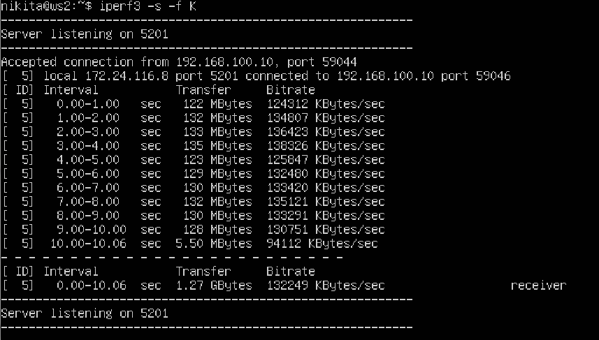
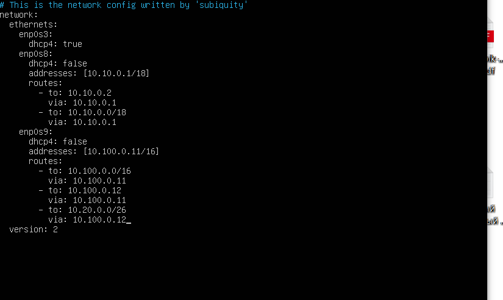
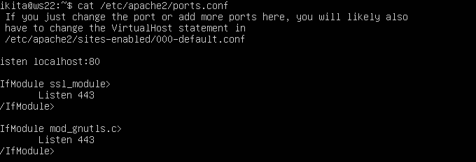

## Report


1. [Содержание](#chapter-iii) \
   3.1. [Инструмент ipcalc](#part-1-инструмент-ipcalc) \
   3.2. [Статическая маршрутизация между двумя машинами](#part-2-статическая-маршрутизация-между-двумя-машинами) \
   3.3. [Утилита iperf3](#part-3-утилита-iperf3) \
   3.4. [Сетевой экран](#part-4-сетевой-экран) \
   3.5. [Статическая маршрутизация сети](#part-5-статическая-маршрутизация-сети) \
   3.6. [Динамическая настройка IP с помощью DHCP](#part-6-динамическая-настройка-ip-с-помощью-dhcp) \
   3.7. [NAT](#part-7-nat) \
   3.8. [Допополнительно. Знакомство с SSH Tunnels](#part-8-дополнительно-знакомство-с-ssh-tunnels)


## Part 1. Инструмент **ipcalc**
`-` Итак, начнём наше погружение в удивительный мир сетей со знакомства с IP адресами. А использовать для этого мы будем инструмент **ipcalc**.

#### 1.1. Сети и маски
##### Определить и записать в отчёт:
##### 1) Адрес сети *192.167.38.54/13*


##### 2) Перевод маски *255.255.255.0* в префиксную и двоичную запись

##### */15* в обычную и двоичную,

#### *11111111.11111111.11111111.11110000* в обычную и префиксную

##### 3) Минимальный и максимальный хост в сети *12.167.38.4* при масках: */8*, *11111111.11111111.00000000.00000000*, *255.255.254.0* и */4*


#### 1.2. localhost
##### Определить и записать в отчёт, можно ли обратиться к приложению, работающему на localhost, со следующими IP: *194.34.23.100*, *127.0.0.2*, *127.1.0.1*, *128.0.0.1* 
#### - *127.0.0.0* — *127.255.255.255* (Reserved for loopback interfaces (not used for communication between network nodes), so called localhost)
- следовательно только *127.0.0.2*, *127.1.0.1*


### 1.3. Диапазоны и сегменты сетей
#### Определить и записать в отчёт:
#### 1) какие из перечисленных IP можно использовать в качестве публичного, а какие только в качестве частных: *10.0.0.45*, *134.43.0.2*, *192.168.4.2*, *172.20.250.4*, *172.0.2.1*, *192.172.0.1*, *172.68.0.2*, *172.16.255.255*, *10.10.10.10*, *192.169.168.1*
Существуют классификации IP-адресов как «частные» и «публичные». Следующие диапазоны адресов зарезервированы для частных (также известных как LAN) сетей: \
10.0.0.0 — 10.255.255.255 ( 10.0.0.0/8 ),\
172.16.0.0 — 172.31.255.255 ( 172.16.0.0/12 ), \
192.168.0.0 — 192.168.255.255 ( 192.168.0.0/16 ). \
127.0.0.0 — 127.255.255.255 (Зарезервировано для петлевых интерфейсов (не используется для связи между узлами сети), так называемый localhost)
- Следовательно частные :*10.0.0.45*, *192.168.4.2*, *172.20.250.4*, *172.16.255.255*, *192.169.168.1*, *10.10.10.10*
- публичные : *134.43.0.2*,  *172.0.2.1*, *192.172.0.1*, *172.68.0.2*

#### 2) какие из перечисленных IP адресов шлюза возможны у сети *10.10.0.0/18*: *10.0.0.1*, *10.10.0.2*, *10.10.10.10*, *10.10.100.1*, *10.10.1.255*
- *10.10.0.2*, *10.10.10.10*, *10.10.1.255* *10.10.100.1*

## Part 2. Статическая маршрутизация между двумя машинами


#### С помощью команды `ip a` посмотреть существующие сетевые интерфейсы
- В отчёт поместить скрин с вызовом и выводом использованной команды.

##### Описать сетевой интерфейс, соответствующий внутренней сети, на обеих машинах и задать следующие адреса и маски: ws1 - *192.168.100.10*, маска */16*, ws2 - *172.24.116.8*, маска */12*
- В отчёт поместить скрины с содержанием изменённого файла *etc/netplan/00-installer-config.yaml* для каждой машины.


#### 2.1. Добавление статического маршрута вручную
##### Добавить статический маршрут от одной машины до другой и обратно при помощи команды вида `ip r add`
##### Пропинговать соединение между машинами
- В отчёт поместить скрин с вызовом и выводом использованных команд.


#### 2.2. Добавление статического маршрута с сохранением
##### Перезапустить машины
##### Добавить статический маршрут от одной машины до другой с помощью файла *etc/netplan/00-installer-config.yaml*
- В отчёт поместить скрин с содержанием изменённого файла *etc/netplan/00-installer-config.yaml*.


##### Пропинговать соединение между машинами
- В отчёт поместить скрин с вызовом и выводом использованной команды.


## Part 3. Утилита **iperf3**
#### 3.1. Скорость соединения
##### Перевести и записать в отчёт: 8 Mbps = 8,38 MB/s, 100 MB/s 95,36 Kbps, 1 Gbps = 1024 Mbps

#### 3.2. Утилита **iperf3**
##### Измерить скорость соединения между ws1 и ws2
- В отчёт поместить скрины с вызовом и выводом использованных команд.

## Part 4. Сетевой экран


-ws2 
-ws1 
Если сначала ACCEPT то с хоста с которого пигуют увидят что пакет дошел


#### 4.2. Утилита **nmap**
##### Командой **ping** найти машину, которая не "пингуется", после чего утилитой **nmap** показать, что хост машины запущен
*Проверка: в выводе nmap должно быть сказано: `Host is up`*
- В отчёт поместить скрины с вызовом и выводом использованных команд **ping** и **nmap**.


## Part 5. Статическая маршрутизация сети

`-` Пока что мы соединяли всего две машины, но теперь пришло время для статической маршрутизации целой сети.

**== Задание ==**

Сеть: \


##### Поднять пять виртуальных машин (3 рабочие станции (ws11, ws21, ws22) и 2 роутера (r1, r2))

#### 5.1. Настройка адресов машин
##### Настроить конфигурации машин в *etc/netplan/00-installer-config.yaml* согласно сети на рисунке.
- В отчёт поместить скрины с содержанием файла *etc/netplan/00-installer-config.yaml* для каждой машины.


##### Перезапустить сервис сети. Если ошибок нет, то командой `ip -4 a` проверить, что адрес машины задан верно. Также пропинговать ws22 с ws21. Аналогично пропинговать r1 с ws11.
- В отчёт поместить скрины с вызовом и выводом использованных команд.


#### 5.2. Включение переадресации IP-адресов.
##### Для включения переадресации IP, выполните команду на роутерах:


#### 5.3. Установка маршрута по-умолчанию
Пример вывода команды `ip r` после добавления шлюза:
```
default via 10.10.0.1 dev eth0
10.10.0.0/18 dev eth0 proto kernel scope link src 10.10.0.2
```
##### Настроить маршрут по-умолчанию (шлюз) для рабочих станций. Для этого добавить `default` перед IP роутера в файле конфигураций
- В отчёт поместить скрин с содержанием файла *etc/netplan/00-installer-config.yaml*.

##### Вызвать `ip r` и показать, что добавился маршрут в таблицу маршрутизации
- В отчёт поместить скрин с вызовом и выводом использованной команды.
##### Пропинговать с ws11 роутер r2 и показать на r2, что пинг доходит. Для этого использовать команду:
`tcpdump -tn -i eth1`
- В отчёт поместить скрин с вызовом и выводом использованных команд.

#### 5.4. Добавление статических маршрутов
##### Добавить в роутеры r1 и r2 статические маршруты в файле конфигураций. 




##### Вызвать `ip r` и показать таблицы с маршрутами на обоих роутерах. Пример таблицы на r1:


- В отчёт поместить скрин с вызовом и выводом использованных команд.
- В отчёте объяснить, почему для адреса 10.10.0.0/\[маска сети\] был выбран маршрут, отличный от 0.0.0.0/0, хотя он попадает под маршрут по-умолчанию.


#### 5.5. Построение списка маршрутизаторов
Пример вывода утилиты **traceroute** после добавления шлюза:

##### Запустить на r1 команду дампа:
`tcpdump -tnv -i eth0`


#### 5.6. Использование протокола **ICMP** при маршрутизации
##### Запустить на r1 перехват сетевого трафика, проходящего через eth0 с помощью команды:
`tcpdump -n -i eth0 icmp`
##### Пропинговать с ws11 несуществующий IP (например, *10.30.0.111*) с помощью команды:
`ping -c 1 10.30.0.111`


##### Сохранить дампы образов виртуальных машин
**p.s. Ни в коем случае не сохранять дампы в гит!**

## Part 6. Динамическая настройка IP с помощью **DHCP**

`-` Следующим нашим шагом будет более подробное знакомство со службой **DHCP**, которую ты уже знаешь.

**== Задание ==**

*В данном задании используются виртуальные машины из Части 5*

##### Для r2 настроить в файле */etc/dhcp/dhcpd.conf* конфигурацию службы **DHCP**:


##### Указать MAC адрес у ws11, для этого в *etc/netplan/00-installer-config.yaml* надо добавить строки: `macaddress: 10:10:10:10:10:BA`, `dhcp4: true`

##### Для r1 настроить аналогично r2, но сделать выдачу адресов с жесткой привязкой к MAC-адресу (ws11). Провести аналогичные тесты


## Part 7. **NAT**

##### В файле */etc/apache2/ports.conf* на ws22 и r1 изменить строку `Listen 80` на `Listen 0.0.0.0:80`, то есть сделать сервер Apache2 общедоступным

аналогично на ws11

##### Запустить веб-сервер Apache командой `service apache2 start` на ws22 и r1

аналогично на ws11

потому что policy FORWARD DROP


##### Проверить соединение по TCP для **SNAT**, для этого с ws22 подключиться к серверу Apache на r1 командой:


## Part 8. Дополнительно. Знакомство с **SSH Tunnels**




